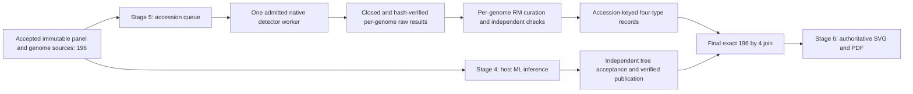

# Decision: stream genome work independently of host-tree inference

Decision as of 2026-10-09: implement the dependency split now. The useful unit is
an approved, immutable genome accession and its source bundle. It is not a leaf
declared final by the running IQ-TREE search. Stage 5 detection and per-genome
curation do not consume the host tree. Final tree-associated results and the
authoritative Stage 6 figure do.

The present full196 tree search is still active. Its candidate topology, branch
lengths and support are not accepted. Its current treefile is not a stream of
independently finalized branches. All196 approved input genomes already exist,
so waiting for a tree event adds no biological prerequisite to detector work.

## Implementation boundary

Replace the prepared Stage 5 dependency on final Stage 4 acceptance/publication
with a gate on the approved panel, accepted source validation and exact source
bytes. Successful detector identity must bind the genome, panel, source,
runtime, models, methods and relevant runner code. A later host-tree hash must
not invalidate identical per-genome detector results. Version the identity and
configuration to avoid silently adopting old semantics. Retain the final-tree
verifier for the join/figure boundary.

The queue state is accession-keyed: pending, admitted, running, closed raw
result, raw validated, curated, independently validated, archived. A failed,
unresolved or not-run accession remains explicitly so. One accepted genome can
move into curation while subsequent genomes wait or run under their admitted
owner. Final completeness still requires all196 accessions and exactly784
type cells (I, II including IIG, III, IV). Zero requires complete negative
evidence; unresolved or not-run is never converted to biological absence.

Current detector code already processes/resumes per genome. Retain full PADLOC
scope and all required DefenseFinder families and replicon accounting. The
approved plan contains435 DefenseFinder native tasks across196 genomes; a
queue record is not a reason to omit secondary replicons, models or profiles.

## What can run now

Source/method/context review, code preparation, synthetic contract tests,
publication and verified cold-cache cleanup can overlap the current tree job.
Per-genome raw output verification and curation can also be independent of a
final tree once actual detector outputs exist. Stage 6 labels, colors, schemas
and vector-format checks can be prepared now; no production figure can claim
the provisional host tree is accepted.

Heavy native concurrency is a separate operational change. The current
IQ-TREE controller holds the exact exclusive Windows workflow lock. The
prepared Windows Stage 5 owner requires that same lock; Linux also has one
global native-runner guard. Removing a scientific tree gate does not replace
those ownership contracts. Do not bypass them or modify the live controller.

Measured at 2026-10-09T18:57:41Z, available physical memory was3,448,430,592bytes
and actual Windows commit headroom4,160,765,952bytes. These are observations,
not admission of an unmeasured WSL detector. The WSL6GiB limit is a maximum,
not proof that it can coexist with the live4.5GiB IQ-TREE job cap and host
reserve. CPU availability alone cannot justify many detector workers.

Primary route: prepare the dependency split now; preserve one native worker.
After exact current job exit, descendant/job closure and workflow-lock release,
run the actual WSL/storage/lease/pidfd fixtures, then measure the first approved
genome as real production work contributing to196. Continue the resumable
genome queue with bounded curation of completed immutable results. Stage 5 no
longer waits for successful Stage 4 validation or tree publication. Even a
closed unsuccessful tree attempt need not invalidate accepted detector work.
Before another heavy tree attempt, resource and sole-owner admission still
apply.

Fallback: if lifecycle, storage or resource checks fail, retain evidence and
defer native searches with the measured reason. Continue light independent
review/preparation. Do not create another controller or launch many workers
based on an estimated per-genome memory size. Reconsider more native workers
only after measured peak usage and a reviewed shared-owner/resource protocol;
that is outside this minimal change.

## Evidence and status

- Prepared source audit: `stage5_atomic.py` had a final-tree gate in
  `validate_upstream`, called before detectors and included in successful cache
  identity. Detector argv consumes the immutable genome bundle and pinned
  tools/models, not a tree.
- The curation bridge and independent curation checks consume genome/native
  evidence. The final matrix/tree join and production renderer retain accepted
  tree requirements.
- Official PADLOC input contract: amino-acid FASTA plus GFF, or nucleotide
  FASTA: https://github.com/padlocbio/padloc/blob/master/README.md
- Official DefenseFinder input contract: genome protein/nucleotide FASTA with
  protein order and replicon formatting:
  https://github.com/mdmparis/defense-finder#input
- IQ-TREE documents candidate-tree optimization, stopping criteria and later
  branch-support computation:
  https://iqtree.github.io/doc/Command-Reference#tree-search-parameters

At this decision: actual Stage 5 searches and Stage 6 production rendering are
NOT_RUN. Prepared code, synthetic fixtures and this decision are not scientific
results. The active native IQ-TREE owner, inputs and configuration are unchanged.

## Implemented and checked — 2026-10-09

Prepared native configuration and scientific identity are now V2. The new gate
binds accepted released source receipts and actual source bytes. The optional
single-approved-accession owner mode enables one real checkpoint followed by
curation; the default queue remains full196. It cannot claim full-panel
completion after one genome. The separate curation producer and independent
checker now require the V2 identity and the same released source pins.

Native/source/owner/storage/interop checks:76 tests,73PASS,3actual Linux cases
skipped. Curation:66 synthetic tests PASS. Four Stage6 negative acceptance/join
gates PASS. Canonical G readback:202small acceptance/build receipts matched
their released-byte pins. No actual detector, WSL integration or production
curation was executed. See the exact source and test receipt in
`reports/master_run/20261009/preparation/stage5_source_split_preparation_checks.json`.

The renderer reads accepted tree, curation and join receipts. The root-owned
finalization workflow must separately invoke retained `validate_upstream`
before production join/render to require accepted Stage4 publication/readback.
This split changes no tree acceptance rule and creates no new native owner.
